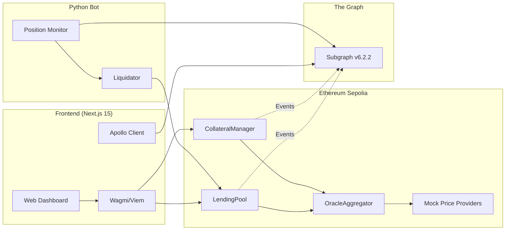
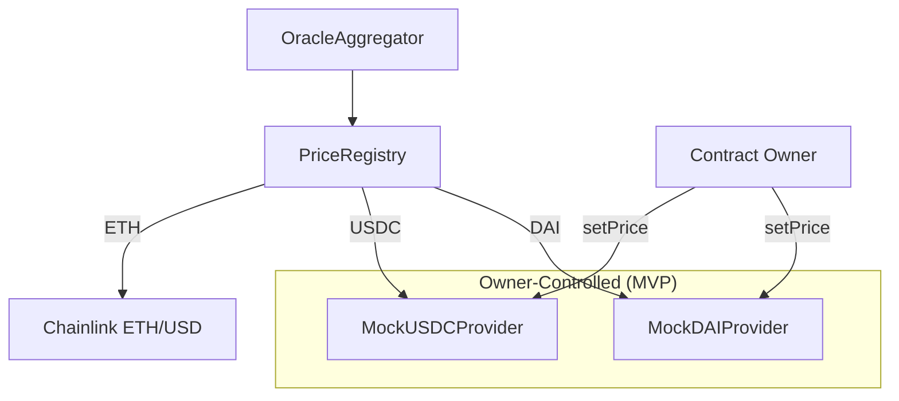

# LendForge

> Decentralized lending protocol with multi-collateral support and automated liquidations on Ethereum Sepolia.

## System Architecture



## Overview

LendForge is a full-stack DeFi lending platform where users deposit collateral (ETH, USDC, DAI) to borrow ETH. The protocol features automated liquidations via a Python bot, real-time health factor monitoring, and a modular oracle system with deviation detection.

**Status:** MVP (Iteration 1) on Sepolia Testnet

> **Note:** This is an MVP using **mock price providers** (owner-controlled prices). Iteration 2 will integrate real Chainlink/Uniswap price feeds. See [docs/iteration2/](docs/iteration2/) for planned architecture.

## Tech Stack

| Layer | Technologies |
|-------|-------------|
| **Smart Contracts** | Solidity 0.8.20, Foundry, OpenZeppelin |
| **Indexing** | The Graph (GraphQL subgraph) |
| **Frontend** | Next.js 15, TypeScript, Wagmi v2, RainbowKit, TailwindCSS |
| **Automation** | Python 3.x, Flask, APScheduler, Web3.py |
| **Oracles** | Mock Price Providers (manual price setting) |

## Key Features

- **Multi-Collateral Support** - Deposit ETH, MockUSDC, or MockDAI as collateral
- **Health Factor Monitoring** - Real-time position health with liquidation alerts
- **Automated Liquidations** - Python bot executes profitable liquidations
- **Mock Oracle System** - Owner-controlled price feeds with deviation detection
- **Emergency Mode** - Protocol pause on critical price deviation (>10%)
- **Proportional Liquidation** - Multi-asset seizure with user protection

## Deployed Contracts (Sepolia)

| Contract | Address | Description |
|----------|---------|-------------|
| LendingPool | `0x504BD0CcAF75881CfCD8f432983A56A5C4e5Aa84` | Borrow/Repay/Liquidate |
| CollateralManager | `0x53Ea723AA0C4cd5eF459eE9351D3f9875D821758` | Multi-asset deposits |
| OracleAggregator | `0x62f41B1EDc66bC46e05c34AC40B447E5A7ab3EAe` | Price aggregation + fallback |
| PriceRegistry | `0x43BcA40deF9Ec42469b6dE95dCBfa38d58584aED` | Asset → Provider routing |
| MockUSDC | `0xC47095AD18C67FBa7E46D56BDBB014901f3e327b` | Test stablecoin (6 decimals) |
| MockDAI | `0x2FA332E8337642891885453Fd40a7a7Bb010B71a` | Test stablecoin (18 decimals) |

### Mock Price Providers

| Provider | Address | Asset |
|----------|---------|-------|
| MockUSDC Provider | `0x92BF794C2e01707bcD8A6b089317645dF0A94D9D` | USDC/USD |
| MockDAI Provider | `0xB1547d572781A58Ae4DcC9Ad29CE92A57C94831c` | DAI/USD |
| MockETH Fallback | `0x97fC84B565f48EF31480c6bBd6677Df297A6AFD6` | ETH/USD (demo mode) |

## Protocol Parameters

| Parameter | ETH | USDC/DAI |
|-----------|-----|----------|
| LTV (Loan-to-Value) | 66% | 90% |
| Liquidation Threshold | 83% | 95% |
| Liquidation Penalty | 10% | 5% |

**Health Factor Formula:**
```
HF = (Collateral USD × Liquidation Threshold) / Debt USD
Liquidation triggered when HF < 1.0
```

## Quick Start

### Prerequisites
- Node.js 18+
- Python 3.11+
- Foundry
- Git

### 1. Clone & Install

```bash
git clone https://github.com/your-username/lendforge.git
cd lendforge

# Install contract dependencies
forge install

# Install frontend dependencies
cd frontend && npm install

# Install bot dependencies
cd ../bot && pip install -r requirements.txt
```

### 2. Environment Setup

```bash
cp .env.example .env
# Edit .env with your RPC URL and private keys
```

### 3. Run Components

**Frontend:**
```bash
cd frontend
npm run dev
# Open http://localhost:3000
```

**Liquidation Bot:**
```bash
cd bot
python -m src.main
# API at http://localhost:5000
```

**Run Tests:**
```bash
forge test -vvv
```

## Project Structure

```
lendforge/
├── contracts/              # Solidity smart contracts
│   ├── LendingPool.sol
│   ├── CollateralManager.sol
│   ├── oracles/
│   │   ├── OracleAggregator.sol
│   │   ├── PriceRegistry.sol
│   │   ├── ManualPriceProvider.sol
│   │   └── mocks/          # Mock price providers
│   └── libraries/
├── frontend/               # Next.js 15 application
│   ├── app/
│   ├── components/
│   └── hooks/
├── bot/                    # Python liquidation bot
│   └── src/
├── subgraph/               # The Graph indexer
│   └── src/
├── scripts/                # Deployment & utility scripts
└── _docs/                  # Technical documentation
```

## Documentation

- [Architecture](./docs/ARCHITECTURE.md) - System design with Mermaid diagrams
- [API Reference](./docs/API.md) - Bot REST endpoints
- [Smart Contracts](./docs/SMART_CONTRACTS.md) - Contract functions reference
- [Deployment](./docs/DEPLOYMENT.md) - Sepolia deployment guide
- [Known Issues](./_docs/KNOWN_ISSUES_ANO.json) - Documented anomalies & workarounds
- [Iteration 2 Plans](./docs/iteration2/) - Future architecture with real oracles

## Oracle System (MVP)

The current MVP uses **mock price providers** where the contract owner manually sets prices:



**Testing deviation:**
1. Owner calls `MockDAIProvider.setPrice(1.05e8)` (5% deviation)
2. OracleAggregator detects deviation, uses fallback
3. If deviation >10%, emergency mode activates

## Bot API

| Endpoint | Method | Description |
|----------|--------|-------------|
| `/health` | GET | Health check |
| `/status` | GET | Protocol + bot status |
| `/metrics` | GET | Liquidation statistics |
| `/monitor` | POST | Trigger monitor cycle |
| `/risky-positions` | GET | List positions near liquidation |
| `/scheduler/status` | GET | Background jobs status |

## Subgraph

**Playground:** [TheGraph Studio](https://api.studio.thegraph.com/query/122308/lendforge-v-4/version/latest)

```graphql
# Get user positions
query GetUserPositions($user: String!) {
  positions(where: { user: $user }) {
    id
    borrowed
    totalCollateralUSD
    healthFactor
    status
  }
}
```

## Testing

```bash
# Run all contract tests
forge test

# Run with verbosity
forge test -vvv

# Coverage report
forge coverage

# Bot unit tests
cd bot && python -m pytest
```

## Known Limitations (MVP)

- **Mock Oracles:** Prices set manually by owner (no real feeds)
- **Mock Tokens:** MockUSDC/MockDAI are custom ERC20, not real stablecoins
- **Centralized Admin:** No DAO/multi-sig (testnet only)
- **Sepolia Only:** Never intended for mainnet deployment

See `_docs/KNOWN_ISSUES_ANO.json` for detailed workarounds.

## Roadmap

### Iteration 1 (Current)
- [x] Multi-collateral support (ETH, MockUSDC, MockDAI)
- [x] Automated liquidations with proportional distribution
- [x] Mock oracle system with deviation detection
- [x] Real-time health factor monitoring
- [x] Python liquidation bot with REST API
- [x] The Graph subgraph indexing

### Iteration 2 (Planned)
- [ ] Real price injection from mainnet Chainlink/Uniswap
- [ ] Uniswap V3 TWAP fallback integration
- [ ] Interest rate model
- [ ] Enhanced analytics dashboard


## Contact

Built as a portfolio project demonstrating full-stack DeFi development:

- Solidity/Foundry smart contracts
- Python backend automation
- Next.js/TypeScript frontend
- The Graph indexing
- Modular oracle architecture
