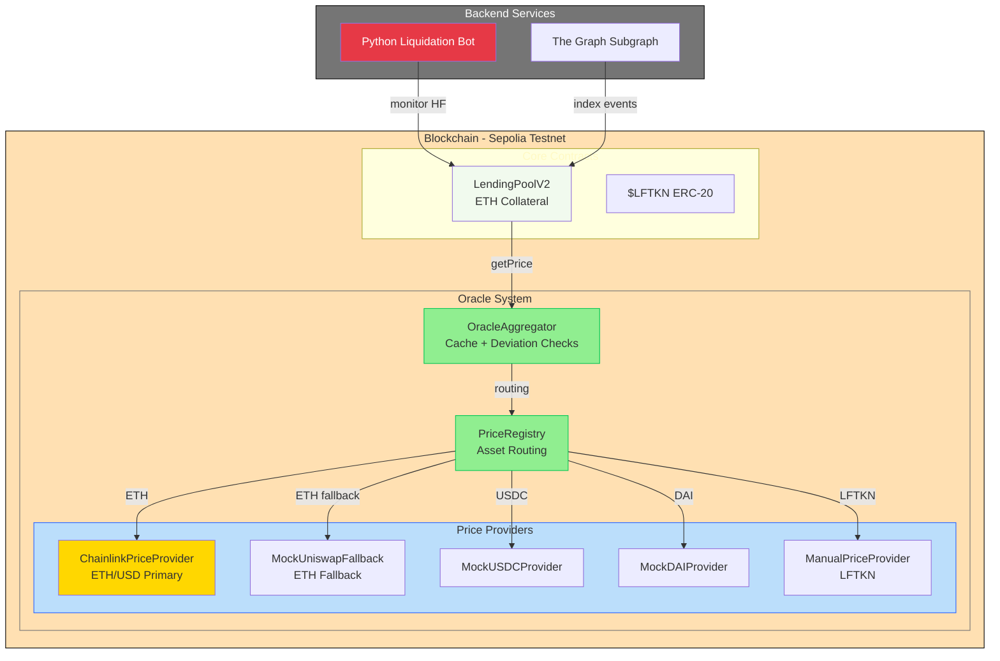

# LendForge

**Decentralized lending platform with multi-source oracle system and automated liquidations.**

---

## Overview

LendForge is a DeFi protocol enabling users to:
- Deposit ETH collateral to borrow stablecoins
- Benefit from multi-source oracle pricing (Chainlink + Uniswap V3 TWAP)
- Participate in automated liquidation mechanisms
- *[Coming in Phase 3]* Multi-collateral support (USDC, DAI, NFTs)
- *[Coming in Phase 3]* Stake $LFTKN for dynamic APY rewards

The platform combines on-chain smart contracts (Solidity/Foundry) with a Python backend for monitoring and a GraphQL API for real-time data access.

---

## Architecture



---

## Project Status

**Current Version:** v1.0.0 (Phase 2 Complete)  
**Status:** Production-ready oracle system + basic lending (ETH collateral)  
**Network:** Sepolia Testnet

### ✅ Completed (Phase 1-2)
- ✅ ERC-20 Token ($LFTKN) with vesting
- ✅ Multi-source oracle system (Chainlink + Uniswap TWAP)
- ✅ Price registry with fallback logic
- ✅ Oracle aggregator with cache & deviation detection
- ✅ Lending pool (ETH collateral only)
- ✅ Health factor calculation & liquidations
- ✅ Python liquidation bot
- ✅ The Graph subgraph

### 🚧 In Progress (Phase 3)
- Multi-collateral support (ETH, USDC, DAI)
- CollateralManager.sol
- StakingPool.sol + RewardDistributor.sol
- Dynamic APY system
- NFT collateral support (optional)
- Frontend dashboard (Next.js)

---

## Tech Stack

### Smart Contracts
- **Solidity** 0.8.24 + **Foundry**
- **Libraries:** OpenZeppelin, Chainlink, Uniswap V3
- **Tests:** 180+ unit tests + E2E integration tests
- **Coverage:** >90%

### Backend
- **Python** 3.11+ (Flask/FastAPI)
- **Web3.py** for blockchain interaction
- **The Graph** for event indexing

### Oracle System (Phase 2 - Completed)
- **ChainlinkPriceProvider:** ETH/USD primary source
- **UniswapV3TWAPLibrary:** Fallback pricing (tested, production-ready)
- **MockProviders:** USDC/DAI (Sepolia feeds unreliable)
- **ManualPriceProvider:** Internal token (LFTKN)
- **Deviation checks:** 5% warning, 10% emergency mode
- **Cache:** 5-minute duration per asset

---

## Key Features

### Multi-Source Oracle ✅
Chainlink primary + Uniswap V3 TWAP fallback with automatic switching, deviation detection (5% warning, 10% critical), and emergency mode protection.

### Basic Lending (ETH) ✅
Deposit ETH collateral, borrow stablecoins with 66% LTV, automated health factor monitoring, and liquidation when HF < 1.0.

### Automated Liquidations ✅
Python bot monitors positions every 60s, calculates profitability including gas, and executes liquidations with 10% bonus.

### Real-Time Indexing ✅
The Graph subgraph provides instant access to TVL, user positions, and liquidation history via GraphQL.

---

## Repository Structure

```
LendForge/
├── contracts/
│   ├── token/              # LFTKN + TokenVesting
│   ├── oracles/            # Oracle system (Phase 2)
│   │   ├── OracleAggregator.sol
│   │   ├── PriceRegistry.sol
│   │   ├── ChainlinkPriceProvider.sol
│   │   ├── UniswapV3PriceProvider.sol
│   │   └── Mock*.sol
│   ├── LendingPoolV2.sol   # Basic lending (ETH)
│   ├── libraries/          # HealthCalculator, DataTypes
│   └── interfaces/         # IPriceProvider, ILendingPool
├── test/
│   ├── unit/               # 140+ unit tests
│   └── integration/        # 85 E2E tests
├── subgraph/               # The Graph indexing
├── bot/                    # Python liquidation bot
└── docs/                   # Architecture & specs
```

---

## Quick Start

### Smart Contracts
```bash
forge install
forge test                          # Run 225+ tests
forge test --match-contract Oracle # Test oracle system only
forge script script/Deploy.s.sol --broadcast --verify
```

### Backend Bot
```bash
cd bot
python -m venv venv && source venv/bin/activate
pip install -r requirements.txt
cp .env.example .env
python src/main.py
```

### Subgraph
```bash
cd subgraph
npm install && npm run codegen && npm run build
graph deploy --studio lendforge
```

---

## Deployed Contracts (Sepolia)

*Coming after Phase 2.8 deployment*

| Contract | Address |
|----------|---------|
| LFTKN | `TBD` |
| OracleAggregator | `TBD` |
| PriceRegistry | `TBD` |
| LendingPoolV2 | `TBD` |

**Chainlink Feed (ETH/USD):** `0x694AA1769357215DE4FAC081bf1f309aDC325306`

---

## Documentation

- [Architecture Overview](./docs/ARCHITECTURE.md)
- [Oracle System Specs](./docs/ORACLE_SYSTEM.md)
- [Phase 3 Roadmap](./docs/PHASE3_PLAN.md)
- [Bot Configuration](./bot/README.md)

---

## Test Coverage

| Component | Unit Tests | Integration | Coverage |
|-----------|-----------|-------------|----------|
| LFTKN Token | 50 | - | 100% |
| Oracle Providers | 70+ | 16 | >95% |
| PriceRegistry | 45 | - | >90% |
| OracleAggregator | 47 | - | >90% |
| LendingPoolV2 | 55 | 30 | >85% |
| **Total** | **225+** | **46** | **>90%** |

---

## Security

- ✅ Timelock on admin functions (24h)
- ✅ Multi-source oracle with deviation checks
- ✅ Emergency mode on critical deviations (>10%)
- ✅ Circuit breakers for extreme volatility
- ✅ Comprehensive test suite (>90% coverage)
- ✅ OpenZeppelin + Chainlink audited dependencies

**Testnet Limitations:** Mock providers used for USDC/DAI/Uniswap due to unreliable Sepolia feeds. Production deployment on mainnet will use real Chainlink feeds and liquid Uniswap pools.

---

## Roadmap

### Phase 1-2 ✅ (Completed)
Token, vesting, oracle system, basic lending

### Phase 3 🚧 (Next - 4-6 weeks)
- CollateralManager (multi-asset)
- StakingPool + rewards
- Dynamic APY
- Frontend dashboard

### Phase 4 (Future)
- NFT collateral
- Governance

---

## Contact

- **GitHub:** [@astierfe](https://github.com/astierfe)
- **Project:** [LendForge Repository](https://github.com/astierfe/LendForge)

---

**Built for the DeFi ecosystem with focus on security and modularity.**
