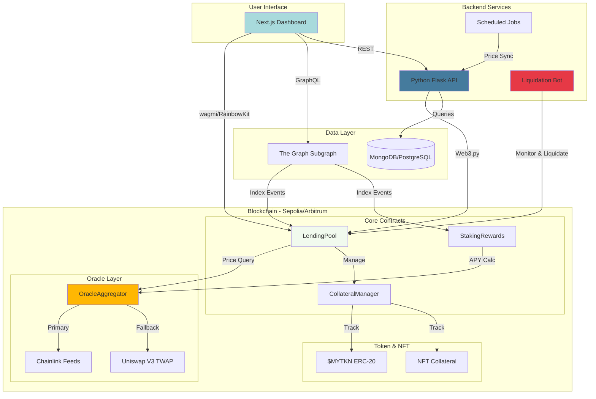

# LendForge

**Decentralized lending and staking platform with multi-collateral support and automated liquidations.**

---

## Overview

LendForge is a DeFi protocol that enables users to:
- Deposit collateral (ETH, USDC, DAI, NFTs) to borrow $MYTKN tokens
- Stake $MYTKN for dynamic APY rewards based on collateral ratio
- Benefit from multi-source oracle pricing (Chainlink + Uniswap)
- Participate in automated liquidation mechanisms

The platform combines on-chain smart contracts with a Python backend for monitoring and a GraphQL API for real-time data access.

---

## Architecture



---

## Tech Stack

### Smart Contracts
- **Language:** Solidity 0.8.24
- **Framework:** Foundry
- **Libraries:** OpenZeppelin, Chainlink, Uniswap V3
- **Network:** Sepolia (testnet) → Arbitrum (mainnet)

### Backend
- **Language:** Python 3.11+
- **Framework:** Flask / FastAPI
- **Web3:** Web3.py
- **Scheduler:** APScheduler
- **Database:** MongoDB / PostgreSQL
- **APIs:** CoinGecko, CoinMarketCap

### Indexing
- **Service:** The Graph Protocol
- **Language:** AssemblyScript
- **Query:** GraphQL

### Frontend
- **Framework:** Next.js 14 (App Router)
- **Styling:** Tailwind CSS + shadcn/ui
- **Web3:** wagmi v2 + RainbowKit
- **Charts:** Recharts / TradingView Lightweight
- **State:** TanStack Query

---

## Key Features

### Multi-Collateral Support
Accept ETH, USDC, DAI, and whitelisted NFTs as collateral with asset-specific risk parameters (LTV, liquidation thresholds, penalties).

### Dynamic APY Staking
Earn variable APY on staked $MYTKN based on collateral ratio with tier system (Bronze/Silver/Gold) and boost mechanisms.

### Multi-Source Oracle
Aggregate prices from Chainlink (primary) and Uniswap V3 TWAP (fallback) with 5% max deviation tolerance and circuit breakers.

### Automated Liquidations
Python bot monitors positions every 60 seconds, calculates profitability including gas costs, and executes liquidations when health factor drops below 1.0.

### Real-Time Analytics
The Graph subgraph indexes all blockchain events providing instant access to TVL, utilization rates, user positions, and liquidation history via GraphQL.

---

## Project Status

**Current Version:** v0.0.1 (PoC#5)  
**Status:** Functional liquidation bot on Sepolia  
**Next Phase:** Oracle Aggregator + Multi-collateral

### Roadmap
- **Phase 1 :** Production-ready oracle and multi-collateral support
- **Phase 2 :** Staking rewards and dynamic APY system
- **Phase 3 :** Frontend dashboard and E2E testing

---

## Repository Structure

```
LendForge/
├── contracts/          # Solidity smart contracts
├── subgraph/          # The Graph indexing
├── bot/               # Python liquidation bot
├── frontend/          # Next.js dashboard (Phase 3)
├── docs/              # Technical documentation
└── tests/             # Integration tests
```

---

## Deployed Contracts (Sepolia)

| Contract | Address |
|----------|---------|
| LendingPoolV2 | `0x16CbF8825A11eAa25DA636E5bC9202190D4E8c5B` |
| SimpleOracle | `0x4eC7F58b90A2aEAb6206ae62f8494b5b7E6aAfcF` |
| MockChainlinkFeed | `0x842a3860f3b20Bcd430d9138BCee42bAbf155fFf` |

**The Graph Subgraph:** [View on Studio](https://thegraph.com/studio/subgraph/chainstaker-poc-4/)

---

## Quick Start

### Prerequisites
- Foundry
- Python 3.11+
- Node.js 18+
- MongoDB / PostgreSQL

### Smart Contracts
```bash
cd contracts
forge install
forge test
forge script script/DeployAll.s.sol --broadcast --verify
```

### Backend Bot
```bash
cd bot
python -m venv venv
source venv/bin/activate
pip install -r requirements.txt
cp .env.example .env  # Configure environment
python src/main.py
```

### Subgraph
```bash
cd subgraph
npm install
npm run codegen
npm run build
graph deploy --studio lendforge
```

---

## Documentation

- [Architecture Overview](./docs/architecture.md)
- [Smart Contract Specifications](./docs/contracts.md)
- [Bot Configuration Guide](./bot/README.md)
- [Subgraph Schema](./subgraph/schema.graphql)
- [API Reference](./docs/api.md)

---

## Security

- Timelock on admin functions (24h delay)
- Multi-source oracle with deviation checks
- Circuit breakers on volatile conditions
- Comprehensive test coverage (>85%)
- Audited dependencies (OpenZeppelin, Chainlink)

**Bug Bounty:** Coming soon

## Contact

- **GitHub:** [@astierfe](https://github.com/astierfe)
- **Project:** [LendForge Repository](https://github.com/astierfe/LendForge)

---

**Built with ❤️ for the DeFi ecosystem**