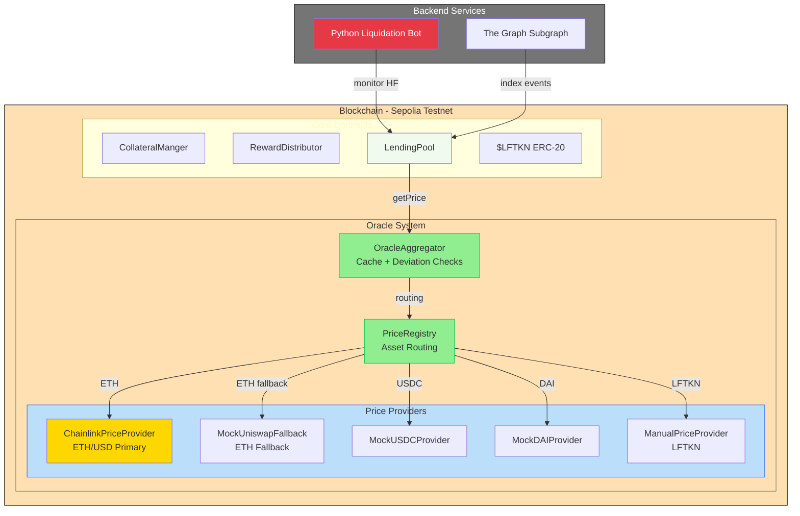

# LendForge

**Decentralized lending platform with multi-collateral support and dual-oracle fallback system.**

---

## Overview

LendForge is a DeFi protocol enabling users to:
- Deposit multi-asset collateral (ETH, USDC, DAI) to borrow stablecoins
- Benefit from dual-source oracle pricing with automatic fallback (Chainlink + Uniswap V3 TWAP)
- Participate in automated liquidation mechanisms
- Stake $LFTKN for dynamic APY rewards

The platform combines on-chain smart contracts (Solidity/Foundry) with a Python backend for monitoring and a GraphQL API for real-time data access.

---

## Architecture



---

## Project Status

**Current Version:** v1.1.0  
**Status:** Oracle fallback implemented, multi-collateral lending active  
**Network:** Sepolia Testnet

### ✅ Completed (Phase 1-3)
- ✅ ERC-20 Token ($LFTKN) with vesting
- ✅ Dual-source oracle system (Chainlink + Uniswap TWAP)
- ✅ **Oracle fallback on deviation >5%** (v3.1)
- ✅ Price registry with automatic fallback routing
- ✅ Oracle aggregator with cache & deviation detection
- ✅ **Multi-collateral support** (ETH, USDC, DAI)
- ✅ CollateralManager for multi-asset tracking
- ✅ Lending pool with health factor & liquidations
- ✅ StakingPool + RewardDistributor (5% APY)

### 🚧 In Progress (Phase 4)
- ⏳ Python liquidation bot v2 (multi-collateral)
- ⏳ The Graph subgraph v2 (multi-collateral events)
- ⏳ Frontend dashboard (Next.js)

---

## Tech Stack

### Smart Contracts
- **Solidity** 0.8.24 + **Foundry**
- **Libraries:** OpenZeppelin 4.9.6, Chainlink, Uniswap V3
- **Tests:** 3+ unit tests + E2E integration tests
- **Coverage:** >90%

### Backend
- **Python** 3.11+ (Flask/FastAPI)
- **Web3.py** for blockchain interaction
- **The Graph** for event indexing

### Oracle System (Phase 2-3 - Completed)
- **ChainlinkPriceProvider:** ETH/USD primary source
- **UniswapV3TWAPLibrary:** Fallback pricing (production-ready)
- **MockProviders:** USDC/DAI (Sepolia feeds unreliable)
- **ManualPriceProvider:** Internal token (LFTKN)
- **Deviation checks:** 5% warning, 10% emergency mode
- **Automatic fallback:** Uses TWAP when deviation exceeds threshold
- **Cache:** 5-minute duration per asset

---

## Key Features

### Dual-Source Oracle with Automatic Fallback ✅
Chainlink primary + Uniswap V3 TWAP fallback with automatic switching based on price deviation:
- Deviation < 5%: Use Chainlink (normal operation)
- Deviation 5-10%: Use Uniswap TWAP + emit warning
- Deviation > 10%: Use Uniswap TWAP + activate emergency mode

### Multi-Collateral Lending ✅
Deposit multiple assets as collateral (ETH, USDC, DAI) with asset-specific LTV ratios:
- ETH: 66% LTV, 83% liquidation threshold
- USDC: 90% LTV, 95% liquidation threshold  
- DAI: 90% LTV, 95% liquidation threshold

### Automated Liquidations (Bot v2 - In Progress)
Python bot monitors positions every 60s, calculates profitability including gas, and executes liquidations with 10% bonus.

### Real-Time Indexing (Subgraph v2 - In Progress)
The Graph subgraph provides instant access to TVL, user positions, and liquidation history via GraphQL.

---

## Deployed Contracts (Sepolia)

| Contract | Address | Version |
|----------|---------|---------|
| LFTKN Token | `0x773349C9f052082e7c2d20feb0dECf3CF24c982d` | v1.0 |
| PriceRegistry | `0x43BcA40deF9Ec42469b6dE95dCBfa38d58584aED` | v1.1 |
| OracleAggregator | `0x62f41B1EDc66bC46e05c34AC40B447E5A7ab3EAe` | v3.1 |
| CollateralManager | `0x53Ea723AA0C4cd5eF459eE9351D3f9875D821758` | v1.1 |
| LendingPool | `0x06AF08708B45968492078A1900124DaA832082cD` | v3.0 |
| StakingPool | `0xC125385BB75B78568Fc5B0884F233B135dbd0020` | v1.0 |
| RewardDistributor | `0xe749B8c31F0c4895baB4e4B94CB2b0049cbe7c24` | v1.0 |

**Chainlink Feed (ETH/USD):** `0x694AA1769357215DE4FAC081bf1f309aDC325306`

---

## Repository Structure

```
LendForge/
├── contracts/
│   ├── token/              # LFTKN + TokenVesting
│   ├── oracles/            # Oracle system v3.1
│   │   ├── OracleAggregator.sol      # v3.1 with fallback
│   │   ├── PriceRegistry.sol
│   │   ├── ChainlinkPriceProvider.sol
│   │   ├── UniswapV3PriceProvider.sol
│   │   └── Mock*.sol
│   ├── CollateralManager.sol         # Multi-asset support
│   ├── LendingPool.sol              # v3.0 multi-collateral
│   ├── StakingPool.sol
│   ├── RewardDistributor.sol
│   ├── libraries/          # HealthCalculator, DataTypes
│   └── interfaces/         # IPriceProvider, ILendingPool
├── test/
│   ├── unit/               # 140+ unit tests
│   └── integration/        # 85 E2E tests
├── script/                 # Deployment scripts
│   ├── DeployFullStackV3.s.sol      # Complete deployment
│   └── UpgradeOracleAggregator.s.sol
├── subgraph/               # The Graph indexing (needs update)
└── bot/                    # Python liquidation bot (needs update)
```

---

## Quick Start

### Smart Contracts
```bash
forge install
forge build
forge test                          # Run 225+ tests
forge test --match-contract Oracle # Test oracle system only
forge script script/DeployFullStackV3.s.sol --broadcast --verify
```

### Backend Bot
```bash
cd bot
python -m venv venv && source venv/bin/activate
pip install -r requirements.txt
cp .env.example .env
python src/main.py
```

### Subgraph
```bash
cd subgraph
npm install && npm run codegen && npm run build
graph deploy --studio lendforge
```

---

## Test Coverage

| Component | Unit Tests | Integration | Coverage |
|-----------|-----------|-------------|----------|
| LFTKN Token | 50 | - | 100% |
| Oracle Providers | 70+ | 16 | >95% |
| PriceRegistry | 45 | - | >90% |
| OracleAggregator | 47 + 17 fallback | - | >90% |
| CollateralManager | 50 | - | >85% |
| LendingPool | 55 | 30 | >85% |
| **Total** | **225+** | **46** | **>90%** |

---

## Security

- ✅ Timelock on admin functions (24h)
- ✅ Dual-source oracle with automatic fallback
- ✅ Emergency mode on critical deviations (>10%)
- ✅ Circuit breakers for extreme volatility
- ✅ Comprehensive test suite (>90% coverage)
- ✅ OpenZeppelin + Chainlink audited dependencies

**Testnet Limitations:** Mock providers used for USDC/DAI/Uniswap due to unreliable Sepolia feeds. Production deployment on mainnet will use real Chainlink feeds and liquid Uniswap pools.

---

## Oracle Fallback Strategy

### Deviation-Based Decision Tree

```
Price Request
    ↓
Get Chainlink (Primary)
    ↓
Get Uniswap TWAP (Fallback)
    ↓
Calculate Deviation
    ↓
    ├─ < 5% → Use Chainlink (normal)
    ├─ 5-10% → Use TWAP + emit warning
    └─ > 10% → Use TWAP + emergency mode
```

### Real-World Scenarios

**Flash Crash Protection:**
- ETH drops $3000 → $1800 in 10 min
- Chainlink updates immediately
- Uniswap TWAP (30min) shows $2400
- Deviation 25% → System uses TWAP
- Result: Users protected from panic liquidations

**Manipulation Protection:**
- Attacker buys $5M ETH in 1 block
- Uniswap spot spikes to $3500
- TWAP smooths to $2050 over 30min
- Chainlink shows $2000
- Deviation 2.5% → System uses Chainlink
- Result: Attack neutralized (cost >$500K)

---

## Roadmap

### Phase 1-3 ✅ (Completed)
Token, vesting, oracle system, multi-collateral lending, staking

### Phase 4 🚧 (In Progress - 4-6 weeks)
- Python bot v2 (multi-collateral liquidations)
- The Graph subgraph v2 (multi-collateral events)
- Frontend dashboard (Next.js)

### Phase 5 (Future)
- NFT collateral
- Governance (DAO)
- Mainnet deployment

---


