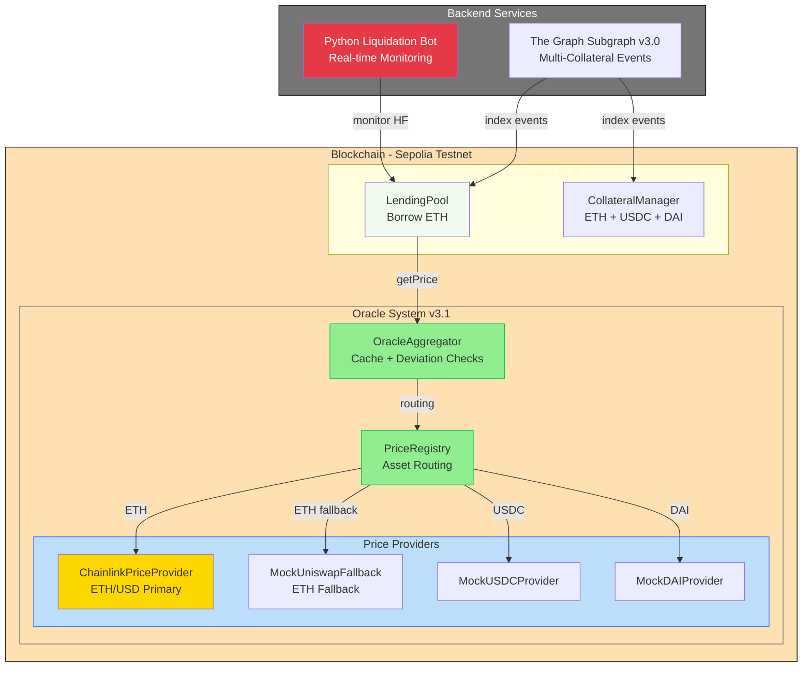

# LendForge v2.0

**ETH-Native Decentralized Lending Platform with Multi-Collateral Support**

---

## Overview

LendForge v2.0 is a DeFi lending protocol enabling users to:
- **Borrow ETH instantly** against multi-asset collateral (ETH, USDC, DAI)
- Benefit from **dual-source oracle** pricing with automatic fallback (Chainlink + Uniswap V3 TWAP)
- Participate in **automated liquidation** mechanisms with profitability calculations
- Access **real-time analytics** via The Graph subgraph

The platform combines on-chain smart contracts (Solidity/Foundry) with a Python backend for monitoring and liquidations.

---

## Architecture



---

## Project Status

**Current Version:** v2.0 ETH-Native
**Status:** Production-ready on Sepolia, bot monitoring active
**Network:** Sepolia Testnet

### ✅ Completed (v2.0)
- ✅ **ETH-Native Architecture** - Borrow ETH against collateral
- ✅ **Dual-source oracle system** (Chainlink + Uniswap V3 TWAP)
- ✅ **Oracle fallback on deviation >5%** (v3.1)
- ✅ **Price registry** with automatic fallback routing
- ✅ **Oracle aggregator** with cache & deviation detection
- ✅ **Multi-collateral support** (ETH, USDC, DAI)
- ✅ **CollateralManager** for multi-asset tracking with LTV enforcement
- ✅ **LendingPool v3.0** with health factor & liquidations
- ✅ **Python liquidation bot** with profitability calculations
- ✅ **The Graph subgraph v3.0** for multi-collateral indexing

### 🚧 In Progress (Phase 2.5)
- ⏳ Frontend dashboard (Next.js)
- ⏳ Complete unit test coverage for LendingPool
- ⏳ Production deployment checklist

---

## Tech Stack

### Smart Contracts
- **Solidity** 0.8.24 + **Foundry**
- **Libraries:** OpenZeppelin 4.9.6, Chainlink, Uniswap V3
- **Tests:** 225+ unit tests + 46 integration tests
- **Coverage:** >90%

### Backend
- **Python** 3.11+ (FastAPI)
- **Web3.py** for blockchain interaction
- **The Graph** for event indexing

### Oracle System (v3.1 - Completed)
- **ChainlinkPriceProvider:** ETH/USD primary source
- **UniswapV3TWAPLibrary:** Fallback pricing (production-ready)
- **MockProviders:** USDC/DAI (Sepolia feeds unreliable)
- **Deviation checks:** 5% warning, 10% emergency mode
- **Automatic fallback:** Uses TWAP when deviation exceeds threshold
- **Cache:** 5-minute duration per asset

---

## Key Features

### Dual-Source Oracle with Automatic Fallback ✅
Chainlink primary + Uniswap V3 TWAP fallback with automatic switching based on price deviation:
- Deviation < 5%: Use Chainlink (normal operation)
- Deviation 5-10%: Use Uniswap TWAP + emit warning
- Deviation > 10%: Use Uniswap TWAP + activate emergency mode

### ETH-Native Borrowing ✅
Borrow ETH instantly against multi-asset collateral:
- **Borrow:** ETH transferred directly to user
- **Repay:** Send ETH to repay debt (partial or full)
- **Liquidate:** Pay ETH to seize under-collateralized positions
- **Decimals:** All amounts in wei (18 decimals)

### Multi-Collateral Support ✅
Deposit multiple assets as collateral with asset-specific LTV ratios:
- **ETH:** 66% LTV, 83% liquidation threshold, 10% liquidation bonus
- **USDC:** 90% LTV, 95% liquidation threshold, 5% liquidation bonus
- **DAI:** 90% LTV, 95% liquidation threshold, 5% liquidation bonus

### Automated Liquidations ✅
Python bot monitors positions every 30s, calculates profitability including gas, and executes liquidations automatically.

### Real-Time Indexing ✅
The Graph subgraph v3.0 provides instant access to TVL, user positions, collateral breakdown, and liquidation history via GraphQL.

---

## Deployed Contracts (Sepolia)

| Contract | Address | Version |
|----------|---------|---------|
| **LendingPool** | `0x06AF08708B45968492078A1900124DaA832082cD` | **v3.0 ETH-Native** |
| **CollateralManager** | `0x53Ea723AA0C4cd5eF459eE9351D3f9875D821758` | v1.1 |
| **OracleAggregator** | `0x62f41B1EDc66bC46e05c34AC40B447E5A7ab3EAe` | v3.1 |
| **PriceRegistry** | `0x43BcA40deF9Ec42469b6dE95dCBfa38d58584aED` | v1.1 |

**Collateral Tokens:**
- USDC: `0xC47095AD18C67FBa7E46D56BDBB014901f3e327b`
- DAI: `0x2FA332E8337642891885453Fd40a7a7Bb010B71a`

**Chainlink Feed (ETH/USD):** `0x694AA1769357215DE4FAC081bf1f309aDC325306`

---

## Repository Structure

```
LendForge/
├── contracts/
│   ├── oracles/            # Oracle system v3.1
│   │   ├── OracleAggregator.sol      # v3.1 with fallback
│   │   ├── PriceRegistry.sol
│   │   ├── ChainlinkPriceProvider.sol
│   │   ├── UniswapV3PriceProvider.sol
│   │   └── mocks/          # Mock providers for Sepolia
│   ├── CollateralManager.sol         # Multi-asset support
│   ├── LendingPool.sol              # v3.0 ETH-native
│   ├── libraries/          # HealthCalculator, DataTypes
│   └── interfaces/         # IPriceProvider, ILendingPool
├── test/
│   ├── unit/               # 225+ unit tests
│   └── integration/        # 46 E2E tests
├── script/                 # Deployment scripts
│   └── DeployFullStackV3.s.sol      # Complete deployment
├── subgraph/               # The Graph v3.0 indexing
├── bot/                    # Python liquidation bot
└── _docs/                  # Technical specifications
```

---

## Quick Start

### Smart Contracts
```bash
forge install
forge build
forge test                          # Run 271+ tests
forge test --match-contract LendingPool # Test lending pool only
forge script script/DeployFullStackV3.s.sol --rpc-url sepolia --broadcast --verify
```

### Backend Bot
```bash
cd bot
python -m venv venv && source venv/bin/activate  # Windows: venv\Scripts\activate
pip install -r requirements.txt
cp .env.example .env
# Edit .env with your RPC URL and private key
python src/main.py
```

### Subgraph
```bash
cd subgraph
npm install && npm run codegen && npm run build
graph deploy --studio lendforge-v3
```

---

## Test Coverage

| Component | Unit Tests | Integration | Coverage |
|-----------|-----------|-------------|----------|
| Oracle Providers | 70+ | 16 | >95% |
| PriceRegistry | 45 | - | >90% |
| OracleAggregator | 64 | - | >90% |
| CollateralManager | 50 | - | >85% |
| LendingPool | 55 | 30 | >85% |
| **Total** | **225+** | **46** | **>90%** |

---

## Security

- ✅ Dual-source oracle with automatic fallback
- ✅ Emergency mode on critical deviations (>10%)
- ✅ Circuit breakers for extreme volatility
- ✅ Comprehensive test suite (>90% coverage)
- ✅ OpenZeppelin + Chainlink audited dependencies
- ✅ Health factor monitoring with liquidation bot

**Testnet Limitations:** Mock providers used for USDC/DAI/Uniswap due to unreliable Sepolia feeds. Production deployment on mainnet will use real Chainlink feeds and liquid Uniswap pools.

---

## Oracle Fallback Strategy

### Deviation-Based Decision Tree

```
Price Request
    ↓
Get Chainlink (Primary)
    ↓
Get Uniswap TWAP (Fallback)
    ↓
Calculate Deviation
    ↓
    ├─ < 5% → Use Chainlink (normal)
    ├─ 5-10% → Use TWAP + emit warning
    └─ > 10% → Use TWAP + emergency mode
```

### Real-World Scenarios

**Flash Crash Protection:**
- ETH drops $3000 → $1800 in 10 min
- Chainlink updates immediately
- Uniswap TWAP (30min) shows $2400
- Deviation 25% → System uses TWAP
- Result: Users protected from panic liquidations

**Manipulation Protection:**
- Attacker buys $5M ETH in 1 block
- Uniswap spot spikes to $3500
- TWAP smooths to $2050 over 30min
- Chainlink shows $2000
- Deviation 2.5% → System uses Chainlink
- Result: Attack neutralized (cost >$500K)

---

## Roadmap

### Phase 1-2 ✅ (Completed)
Oracle system v3.1 with fallback, multi-collateral support, ETH-native architecture

### Phase 2.5 🚧 (In Progress - 2-3 weeks)
- Complete unit test coverage (LendingPool borrow/repay/liquidate)
- Frontend dashboard (Next.js)
- Production deployment checklist
- Mainnet deployment preparation

### Phase 3 (Future)
- Additional collateral types (WBTC, blue-chip tokens)
- NFT collateral (whitelist-based)
- Governance (DAO)
- Multi-chain deployment

---

## Documentation

Detailed specifications available in `_docs/`:
- `spec_lending_pool_updated.md` - Complete v2.0 technical specification
- `bugs_identified.md` - Known issues and resolutions

---

## License

MIT
