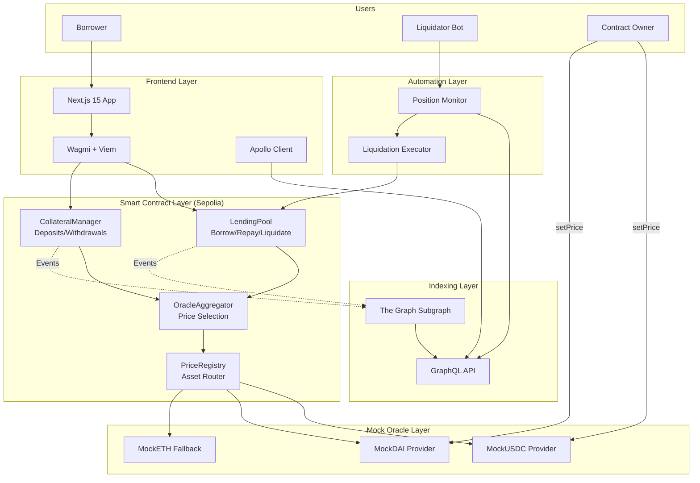
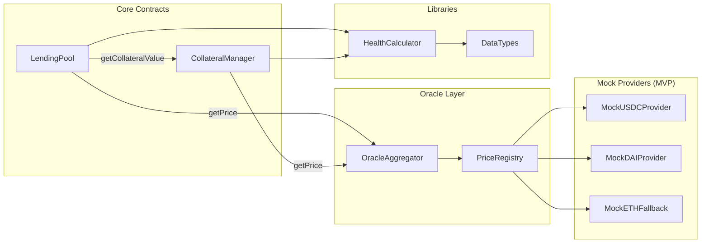
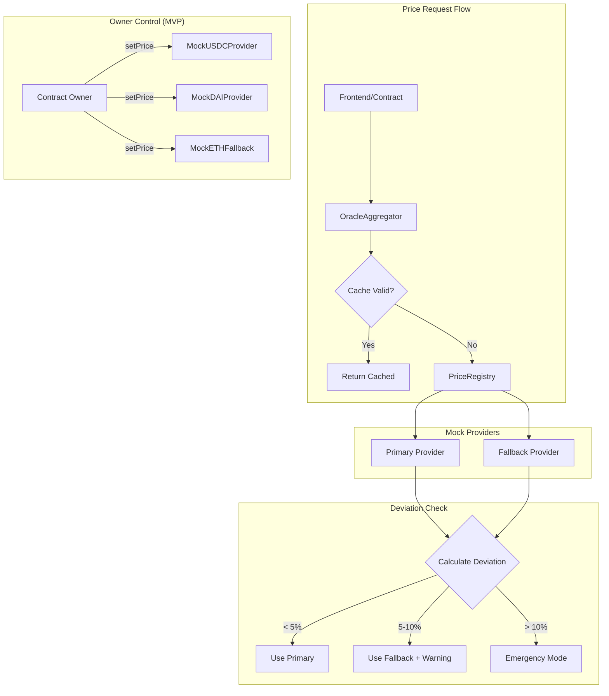
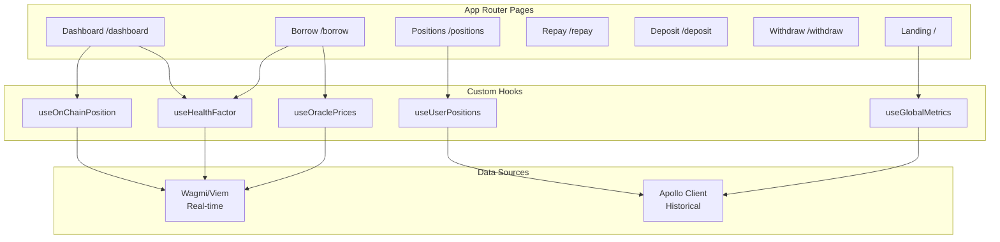
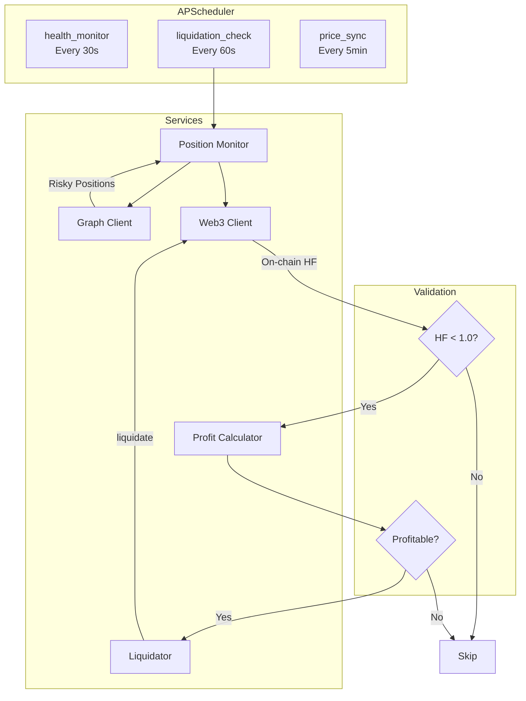
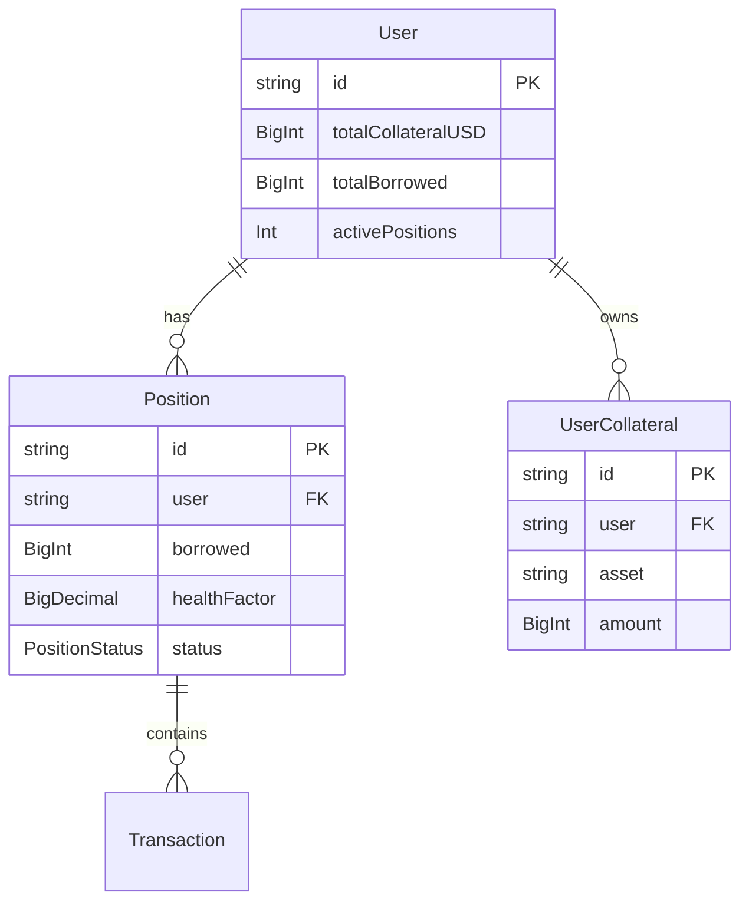
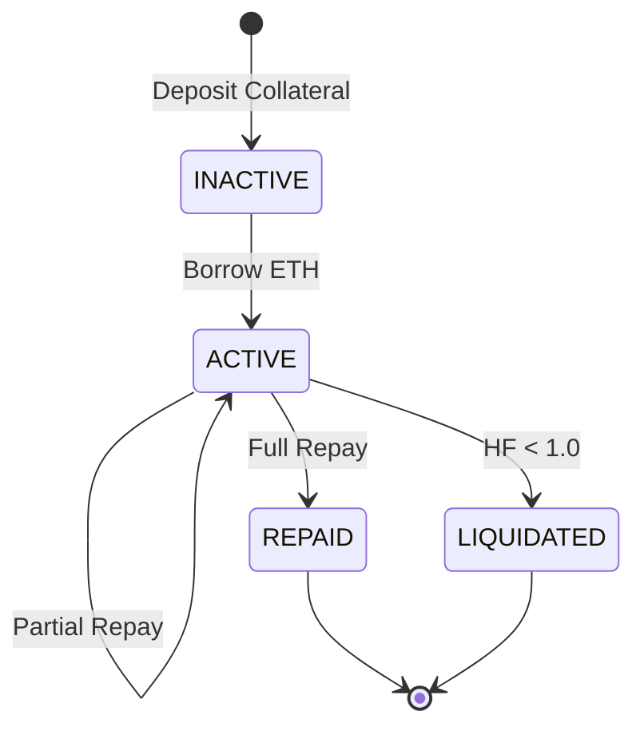
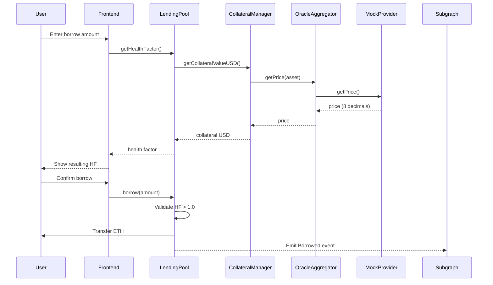
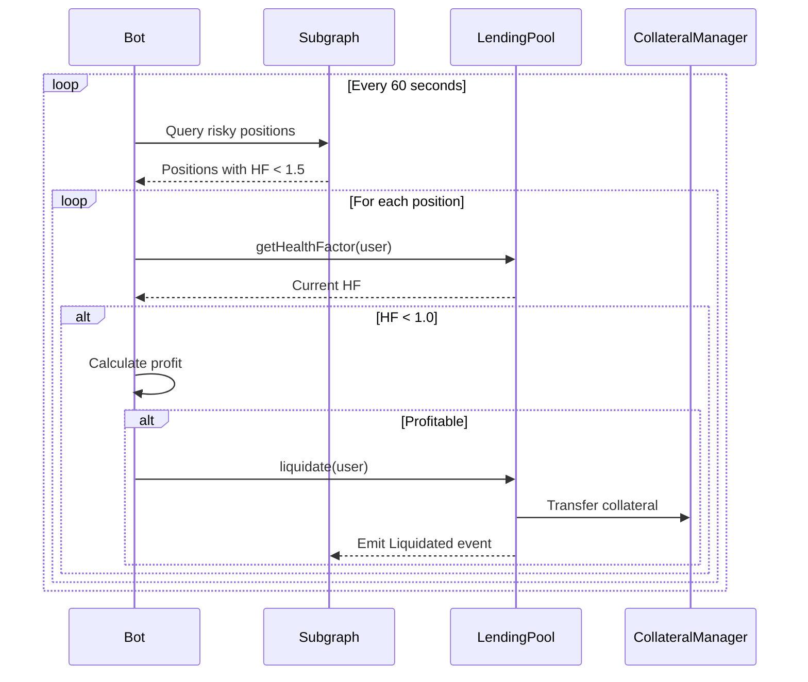

# LendForge Architecture (Iteration 1 - MVP)

Technical architecture of the LendForge DeFi lending protocol with mock oracle system.

## Table of Contents

- [System Overview](#system-overview)
- [Smart Contracts](#smart-contracts)
- [Oracle System (Mock)](#oracle-system-mock)
- [Frontend Architecture](#frontend-architecture)
- [Liquidation Bot](#liquidation-bot)
- [The Graph Subgraph](#the-graph-subgraph)
- [Data Flow Patterns](#data-flow-patterns)

---

## System Overview



---

## Smart Contracts

### Contract Interaction Diagram



### Contract Addresses (Sepolia)

| Contract | Address | Version |
|----------|---------|---------|
| LendingPool | `0x504BD0CcAF75881CfCD8f432983A56A5C4e5Aa84` | v3.0 |
| CollateralManager | `0x53Ea723AA0C4cd5eF459eE9351D3f9875D821758` | v1.1 |
| OracleAggregator | `0x62f41B1EDc66bC46e05c34AC40B447E5A7ab3EAe` | v3.1 |
| PriceRegistry | `0x43BcA40deF9Ec42469b6dE95dCBfa38d58584aED` | v1.1 |

### Mock Tokens

| Token | Address | Decimals | Description |
|-------|---------|----------|-------------|
| MockUSDC | `0xC47095AD18C67FBa7E46D56BDBB014901f3e327b` | 6 | Custom ERC20 with mint() |
| MockDAI | `0x2FA332E8337642891885453Fd40a7a7Bb010B71a` | 18 | Custom ERC20 with mint() |
| ETH | `0xEeeeeEeeeEeEeeEeEeEeeEEEeeeeEeeeeeeeEEeE` | 18 | Native (virtual address) |

---

## Oracle System (Mock)

### MVP Architecture

In Iteration 1, prices are **manually set by the contract owner**. This allows testing of:
- Liquidation flows with controlled price movements
- Deviation detection logic
- Emergency mode triggers



### Price Provider Configuration

| Asset | Primary Provider | Fallback Provider |
|-------|-----------------|-------------------|
| ETH | Chainlink ETH/USD (real) | MockETHFallback (demo) |
| USDC | MockUSDCProvider | None |
| DAI | MockDAIProvider | None |

### Deviation Thresholds

| Deviation | Action | Operations |
|-----------|--------|------------|
| < 5% | Use primary price | All allowed |
| 5-10% | Use fallback + emit warning | All allowed |
| > 10% | Emergency mode | Repay, Withdraw, Liquidate only |

### Testing Deviation (MVP)

```solidity
// Owner simulates price deviation for testing
MockDAIProvider.setPrice(1.05e8);  // DAI at $1.05 (5% deviation)
// OracleAggregator detects deviation, uses fallback

MockDAIProvider.setPrice(1.15e8);  // DAI at $1.15 (15% deviation)
// OracleAggregator triggers emergency mode
```

---

## Frontend Architecture

### Component Structure



### Data Source Strategy

| Data Type | Source | Refresh | Use Case |
|-----------|--------|---------|----------|
| Position balance | On-chain (Wagmi) | 5s | Dashboard, Borrow, Repay |
| Health factor | On-chain (Wagmi) | 5s | Real-time monitoring |
| Oracle prices | On-chain (Wagmi) | 5s | Calculations |
| Position history | Subgraph (Apollo) | 5-30s | Positions page |
| Global metrics | Subgraph (Apollo) | 5-30s | Landing, Analytics |

---

## Liquidation Bot

### Bot Architecture



### Profitability Formula

```python
collateral_seized_usd = debt_to_repay * (1 + LIQUIDATION_BONUS)
gas_cost_usd = gas_used * gas_price * eth_price
profit = collateral_seized_usd - debt_to_repay - gas_cost_usd

# Execution criteria
MIN_PROFIT_USD = 5.0
MAX_GAS_PRICE_GWEI = 50
```

### Background Jobs

| Job | Interval | Purpose |
|-----|----------|---------|
| `health_monitor` | 30s | Log risky positions |
| `liquidation_check` | 60s | Execute liquidations |
| `price_sync` | 5min | Sync oracle prices |

---

## The Graph Subgraph

### Entity Relationships



### Position Status Flow



### Event Handlers

| Event | Handler | Entities Updated |
|-------|---------|-----------------|
| `CollateralDeposited` | `handleCollateralDeposited` | User, UserCollateral |
| `CollateralWithdrawn` | `handleCollateralWithdrawn` | User, UserCollateral |
| `Borrowed` | `handleBorrowed` | User, Position |
| `Repaid` | `handleRepaid` | User, Position |
| `Liquidated` | `handleLiquidated` | User, Position, Liquidation |

---

## Data Flow Patterns

### Borrow Flow



### Liquidation Flow



---

## Known Limitations (MVP)

### Iteration 1 Constraints

| Limitation | Description | Iteration 2 Solution |
|------------|-------------|---------------------|
| Mock Oracles | Prices set manually by owner | Real Chainlink + Uniswap injection |
| Mock Tokens | Custom ERC20 (not real stablecoins) | Same tokens, real prices |
| No TWAP | No time-weighted average prices | Uniswap V3 TWAP integration |
| Centralized | Owner controls all prices | Automated price feeds |

### Documented Workarounds

See `_docs/KNOWN_ISSUES_ANO.json` for:
- ANO_001: Active positions count workaround
- ANO_002: USDC decimal override
- ANO_003: USD value calculation
- ANO_009: Cross-user data contamination fix

---

## Resources

- **Subgraph:** [TheGraph Studio](https://api.studio.thegraph.com/query/122308/lendforge-v-4/version/latest)
- **Explorer:** [Sepolia Etherscan](https://sepolia.etherscan.io)
- **Iteration 2:** [docs/iteration2/](./iteration2/)
