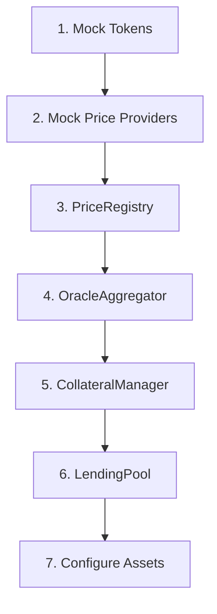

# LendForge Deployment Guide

Step-by-step guide to deploy LendForge on Ethereum Sepolia testnet.

## Prerequisites

### Required Tools

```bash
# Foundry (Solidity toolkit)
curl -L https://foundry.paradigm.xyz | bash
foundryup

# Node.js 18+
node --version  # v18.0.0+

# Python 3.11+
python --version  # 3.11+
```

### Required Accounts

1. **Deployer Wallet** — ETH for gas fees
2. **Sepolia ETH** — Get from faucet:
   - https://sepoliafaucet.com
   - https://faucet.sepolia.dev

### Environment Setup

Create `.env` file at project root:

```bash
# Network
SEPOLIA_RPC_URL=https://eth-sepolia.g.alchemy.com/v2/YOUR_API_KEY

# Deployer account
DEPLOYER_PRIVATE_KEY=0x...
DEPLOYER_ADDRESS=0x...

# Optional: Etherscan verification
ETHERSCAN_API_KEY=...
```

---

## Deployment Order

Contracts must be deployed in this specific order due to dependencies:



---

## Step 1: Deploy Mock Tokens

Deploy MockUSDC and MockDAI ERC20 tokens.

```bash
forge script script/DeployMockTokens.s.sol:DeployMockTokens \
  --rpc-url $SEPOLIA_RPC_URL \
  --private-key $DEPLOYER_PRIVATE_KEY \
  --broadcast \
  --verify
```

**Expected Output:**
```
MockUSDC deployed at: 0x...
MockDAI deployed at: 0x...
```

Save addresses to `.env`:
```bash
USDC_TOKEN_ADDRESS=0x...
DAI_TOKEN_ADDRESS=0x...
ETH_ADDRESS=0xEeeeeEeeeEeEeeEeEeEeeEEEeeeeEeeeeeeeEEeE
```

---

## Step 2: Deploy Mock Price Providers

Deploy price providers for each asset.

```bash
forge script script/DeployMockProviders.s.sol:DeployMockProviders \
  --rpc-url $SEPOLIA_RPC_URL \
  --private-key $DEPLOYER_PRIVATE_KEY \
  --broadcast \
  --verify
```

**Initial Prices (8 decimals):**
- USDC: `1e8` ($1.00)
- DAI: `1e8` ($1.00)
- ETH Fallback: `2500e8` ($2,500.00)

Save addresses:
```bash
MOCK_USDC_PROVIDER=0x...
MOCK_DAI_PROVIDER=0x...
MOCK_ETH_FALLBACK=0x...
```

---

## Step 3: Deploy PriceRegistry

Central router for asset → provider mapping.

```bash
forge script script/DeployPriceRegistry.s.sol:DeployPriceRegistry \
  --rpc-url $SEPOLIA_RPC_URL \
  --private-key $DEPLOYER_PRIVATE_KEY \
  --broadcast \
  --verify
```

Save address:
```bash
PRICE_REGISTRY_ADDRESS=0x...
```

---

## Step 4: Deploy OracleAggregator

Smart price selection with deviation detection.

```bash
forge script script/DeployOracleAggregator.s.sol:DeployOracleAggregator \
  --rpc-url $SEPOLIA_RPC_URL \
  --private-key $DEPLOYER_PRIVATE_KEY \
  --broadcast \
  --verify
```

**Constructor Args:**
- `registry`: PriceRegistry address

Save address:
```bash
ORACLE_AGGREGATOR_ADDRESS=0x...
```

---

## Step 5: Deploy CollateralManager

Multi-asset collateral management.

```bash
forge script script/DeployCollateralManager.s.sol:DeployCollateralManager \
  --rpc-url $SEPOLIA_RPC_URL \
  --private-key $DEPLOYER_PRIVATE_KEY \
  --broadcast \
  --verify
```

**Constructor Args:**
- `oracle`: OracleAggregator address

Save address:
```bash
COLLATERAL_MANAGER_ADDRESS=0x...
```

---

## Step 6: Deploy LendingPool

Core lending contract.

```bash
forge script script/DeployLendingPool.s.sol:DeployLendingPool \
  --rpc-url $SEPOLIA_RPC_URL \
  --private-key $DEPLOYER_PRIVATE_KEY \
  --broadcast \
  --verify
```

**Constructor Args:**
- `collateralManager`: CollateralManager address
- `oracle`: OracleAggregator address

Save address:
```bash
LENDING_POOL_ADDRESS=0x...
```

---

## Step 7: Configure Assets

### 7.1 Register Assets in PriceRegistry

```bash
# Register ETH (Chainlink primary, mock fallback)
cast send $PRICE_REGISTRY_ADDRESS \
  "addAsset(address,string,address,address,uint8)" \
  $ETH_ADDRESS "ETH" $CHAINLINK_ETH_PROVIDER $MOCK_ETH_FALLBACK 18 \
  --rpc-url $SEPOLIA_RPC_URL \
  --private-key $DEPLOYER_PRIVATE_KEY

# Register USDC (mock provider only)
cast send $PRICE_REGISTRY_ADDRESS \
  "addAsset(address,string,address,address,uint8)" \
  $USDC_TOKEN_ADDRESS "USDC" $MOCK_USDC_PROVIDER $ZERO_ADDRESS 6 \
  --rpc-url $SEPOLIA_RPC_URL \
  --private-key $DEPLOYER_PRIVATE_KEY

# Register DAI (mock provider only)
cast send $PRICE_REGISTRY_ADDRESS \
  "addAsset(address,string,address,address,uint8)" \
  $DAI_TOKEN_ADDRESS "DAI" $MOCK_DAI_PROVIDER $ZERO_ADDRESS 18 \
  --rpc-url $SEPOLIA_RPC_URL \
  --private-key $DEPLOYER_PRIVATE_KEY
```

### 7.2 Add Assets to CollateralManager

```bash
# Add ETH collateral (66% LTV, 83% liquidation threshold, 10% penalty)
cast send $COLLATERAL_MANAGER_ADDRESS \
  "addAsset(address,string,uint256,uint256,uint256,uint8)" \
  $ETH_ADDRESS "ETH" 66 83 10 18 \
  --rpc-url $SEPOLIA_RPC_URL \
  --private-key $DEPLOYER_PRIVATE_KEY

# Add USDC collateral (90% LTV, 95% threshold, 5% penalty)
cast send $COLLATERAL_MANAGER_ADDRESS \
  "addAsset(address,string,uint256,uint256,uint256,uint8)" \
  $USDC_TOKEN_ADDRESS "USDC" 90 95 5 6 \
  --rpc-url $SEPOLIA_RPC_URL \
  --private-key $DEPLOYER_PRIVATE_KEY

# Add DAI collateral (90% LTV, 95% threshold, 5% penalty)
cast send $COLLATERAL_MANAGER_ADDRESS \
  "addAsset(address,string,uint256,uint256,uint256,uint8)" \
  $DAI_TOKEN_ADDRESS "DAI" 90 95 5 18 \
  --rpc-url $SEPOLIA_RPC_URL \
  --private-key $DEPLOYER_PRIVATE_KEY
```

---

## Step 8: Fund LendingPool

Deposit ETH liquidity for borrowing.

```bash
# Send 10 ETH to LendingPool
cast send $LENDING_POOL_ADDRESS \
  --value 10ether \
  --rpc-url $SEPOLIA_RPC_URL \
  --private-key $DEPLOYER_PRIVATE_KEY
```

---

## Step 9: Verify Deployment

### Check Contract States

```bash
# Verify PriceRegistry assets
cast call $PRICE_REGISTRY_ADDRESS "getSupportedAssets()" --rpc-url $SEPOLIA_RPC_URL

# Verify CollateralManager assets
cast call $COLLATERAL_MANAGER_ADDRESS "getSupportedAssets()" --rpc-url $SEPOLIA_RPC_URL

# Check LendingPool balance
cast balance $LENDING_POOL_ADDRESS --rpc-url $SEPOLIA_RPC_URL

# Test price fetch
cast call $ORACLE_AGGREGATOR_ADDRESS "getPrice(address)" $ETH_ADDRESS --rpc-url $SEPOLIA_RPC_URL
```

### Verify on Etherscan

```bash
# Verify all contracts
forge verify-contract $LENDING_POOL_ADDRESS LendingPool \
  --chain sepolia \
  --etherscan-api-key $ETHERSCAN_API_KEY
```

---

## Subgraph Deployment

### 1. Update subgraph.yaml

```yaml
dataSources:
  - name: LendingPool
    source:
      address: "0x504BD0CcAF75881CfCD8f432983A56A5C4e5Aa84"
      startBlock: 9598501
  - name: CollateralManager
    source:
      address: "0x53Ea723AA0C4cd5eF459eE9351D3f9875D821758"
      startBlock: 9598501
```

### 2. Deploy to TheGraph

```bash
cd subgraph

# Generate types
graph codegen

# Build
graph build

# Deploy
graph deploy --studio lendforge-v-4
```

---

## Frontend Configuration

### Update Contract Addresses

Edit `frontend/lib/contracts/addresses.ts`:

```typescript
export const CONTRACTS = {
  LENDING_POOL: "0x504BD0CcAF75881CfCD8f432983A56A5C4e5Aa84",
  COLLATERAL_MANAGER: "0x53Ea723AA0C4cd5eF459eE9351D3f9875D821758",
  ORACLE_AGGREGATOR: "0x62f41B1EDc66bC46e05c34AC40B447E5A7ab3EAe",
  USDC: "0xC47095AD18C67FBa7E46D56BDBB014901f3e327b",
  DAI: "0x2FA332E8337642891885453Fd40a7a7Bb010B71a",
};
```

### Update Subgraph URL

Edit `frontend/lib/graphql/apollo-client.ts`:

```typescript
const SUBGRAPH_URL = "https://api.studio.thegraph.com/query/122308/lendforge-v-4/version/latest";
```

---

## Bot Configuration

### Environment Variables

Create `bot/.env`:

```bash
# Network
SEPOLIA_RPC_URL=https://eth-sepolia.g.alchemy.com/v2/YOUR_KEY

# Liquidator wallet (separate from deployer!)
LIQUIDATOR_PRIVATE_KEY=0x...
LIQUIDATOR_ADDRESS=0x5bB616C961D258DeAF8115574401C06600c2a595

# Contracts
LENDING_POOL_ADDRESS=0x504BD0CcAF75881CfCD8f432983A56A5C4e5Aa84
COLLATERAL_MANAGER_ADDRESS=0x53Ea723AA0C4cd5eF459eE9351D3f9875D821758
ORACLE_AGGREGATOR_ADDRESS=0x62f41B1EDc66bC46e05c34AC40B447E5A7ab3EAe

# Subgraph
SUBGRAPH_URL=https://api.studio.thegraph.com/query/122308/lendforge-v-4/version/latest

# Bot config
MONITOR_INTERVAL_SECONDS=60
MIN_PROFIT_USD=5.0
MAX_GAS_PRICE_GWEI=50
```

### Fund Liquidator Wallet

```bash
# Send ETH for gas and liquidations
cast send $LIQUIDATOR_ADDRESS \
  --value 1ether \
  --rpc-url $SEPOLIA_RPC_URL \
  --private-key $DEPLOYER_PRIVATE_KEY
```

---

## Test Deployment

### 1. Mint Test Tokens

```bash
# Mint 10,000 MockUSDC to test user
cast send $USDC_TOKEN_ADDRESS \
  "mint(address,uint256)" \
  $USER_ADDRESS 10000000000 \
  --rpc-url $SEPOLIA_RPC_URL \
  --private-key $DEPLOYER_PRIVATE_KEY

# Mint 10,000 MockDAI to test user
cast send $DAI_TOKEN_ADDRESS \
  "mint(address,uint256)" \
  $USER_ADDRESS 10000000000000000000000 \
  --rpc-url $SEPOLIA_RPC_URL \
  --private-key $DEPLOYER_PRIVATE_KEY
```

### 2. Test Deposit & Borrow Flow

```bash
# As USER: Approve USDC
cast send $USDC_TOKEN_ADDRESS \
  "approve(address,uint256)" \
  $COLLATERAL_MANAGER_ADDRESS 1000000000 \
  --rpc-url $SEPOLIA_RPC_URL \
  --private-key $USER_PRIVATE_KEY

# As USER: Deposit 1000 USDC
cast send $COLLATERAL_MANAGER_ADDRESS \
  "depositERC20(address,uint256)" \
  $USDC_TOKEN_ADDRESS 1000000000 \
  --rpc-url $SEPOLIA_RPC_URL \
  --private-key $USER_PRIVATE_KEY

# As USER: Borrow 0.3 ETH
cast send $LENDING_POOL_ADDRESS \
  "borrow(uint256)" \
  300000000000000000 \
  --rpc-url $SEPOLIA_RPC_URL \
  --private-key $USER_PRIVATE_KEY

# Check health factor
cast call $LENDING_POOL_ADDRESS \
  "getHealthFactor(address)" \
  $USER_ADDRESS \
  --rpc-url $SEPOLIA_RPC_URL
```

### 3. Test Price Update (Mock Oracle)

```bash
# As OWNER: Update DAI price to $1.05 (simulate deviation)
cast send $MOCK_DAI_PROVIDER \
  "setPrice(int256)" \
  105000000 \
  --rpc-url $SEPOLIA_RPC_URL \
  --private-key $DEPLOYER_PRIVATE_KEY

# Verify new price
cast call $ORACLE_AGGREGATOR_ADDRESS \
  "getPrice(address)" \
  $DAI_TOKEN_ADDRESS \
  --rpc-url $SEPOLIA_RPC_URL
```

---

## Deployed Addresses Reference

| Contract | Sepolia Address |
|----------|-----------------|
| LendingPool | `0x504BD0CcAF75881CfCD8f432983A56A5C4e5Aa84` |
| CollateralManager | `0x53Ea723AA0C4cd5eF459eE9351D3f9875D821758` |
| OracleAggregator | `0x62f41B1EDc66bC46e05c34AC40B447E5A7ab3EAe` |
| PriceRegistry | `0x43BcA40deF9Ec42469b6dE95dCBfa38d58584aED` |
| MockUSDC | `0xC47095AD18C67FBa7E46D56BDBB014901f3e327b` |
| MockDAI | `0x2FA332E8337642891885453Fd40a7a7Bb010B71a` |
| MockUSDC Provider | `0x92BF794C2e01707bcD8A6b089317645dF0A94D9D` |
| MockDAI Provider | `0xB1547d572781A58Ae4DcC9Ad29CE92A57C94831c` |
| MockETH Fallback | `0x97fC84B565f48EF31480c6bBd6677Df297A6AFD6` |

---

## Troubleshooting

### "Insufficient funds" Error
- Ensure deployer has enough Sepolia ETH
- Get more from faucet

### "Contract not verified"
- Check Etherscan API key
- Ensure constructor args match

### "Price stale" Error
- Mock provider prices expire after 24h
- Call `setPrice()` to refresh

### Subgraph Not Syncing
- Check startBlock matches deployment
- Verify contract addresses in subgraph.yaml
