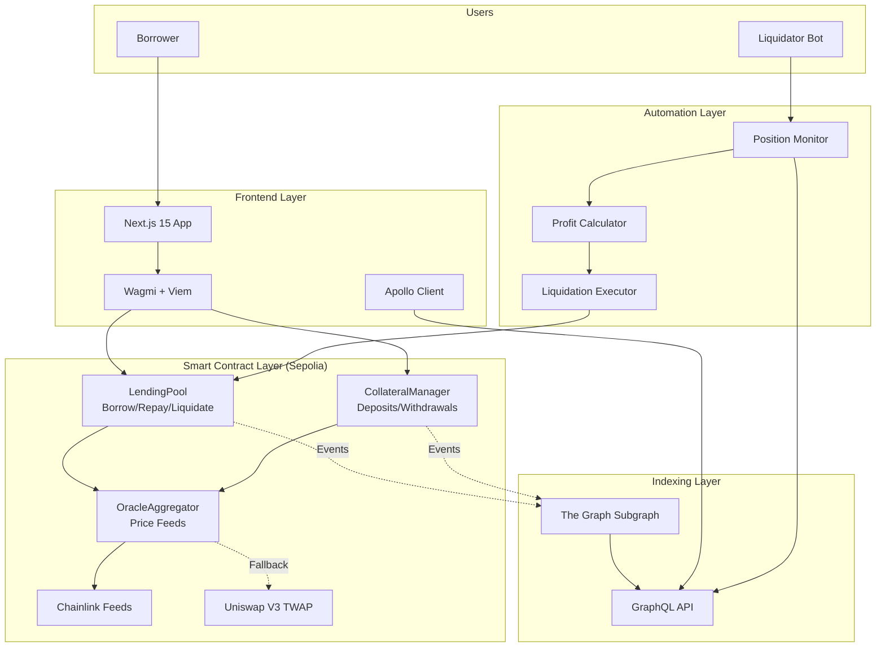
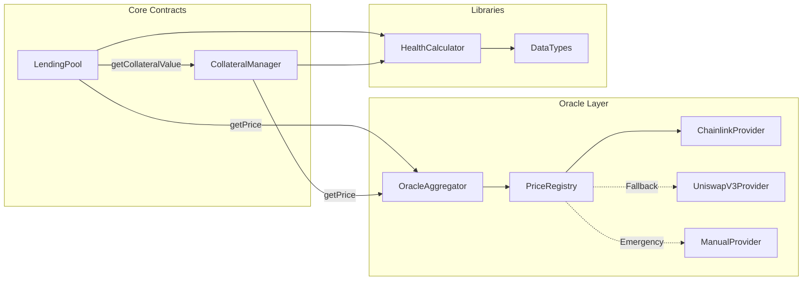
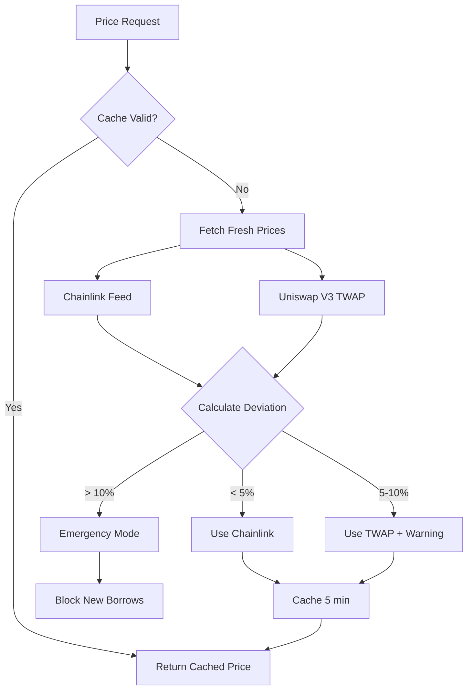
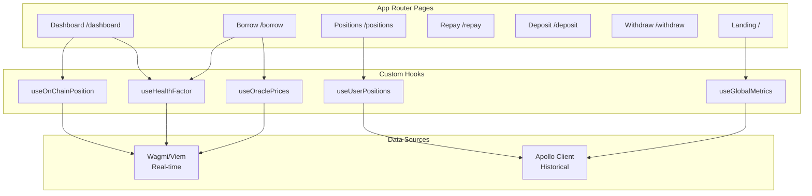
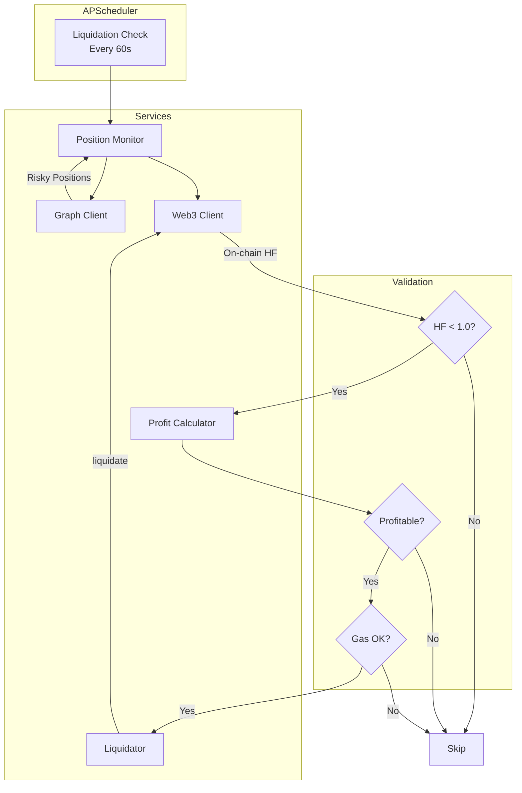
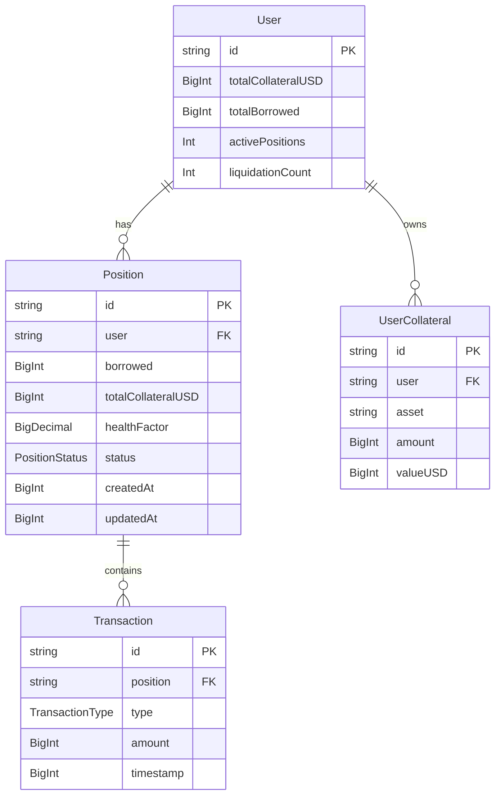
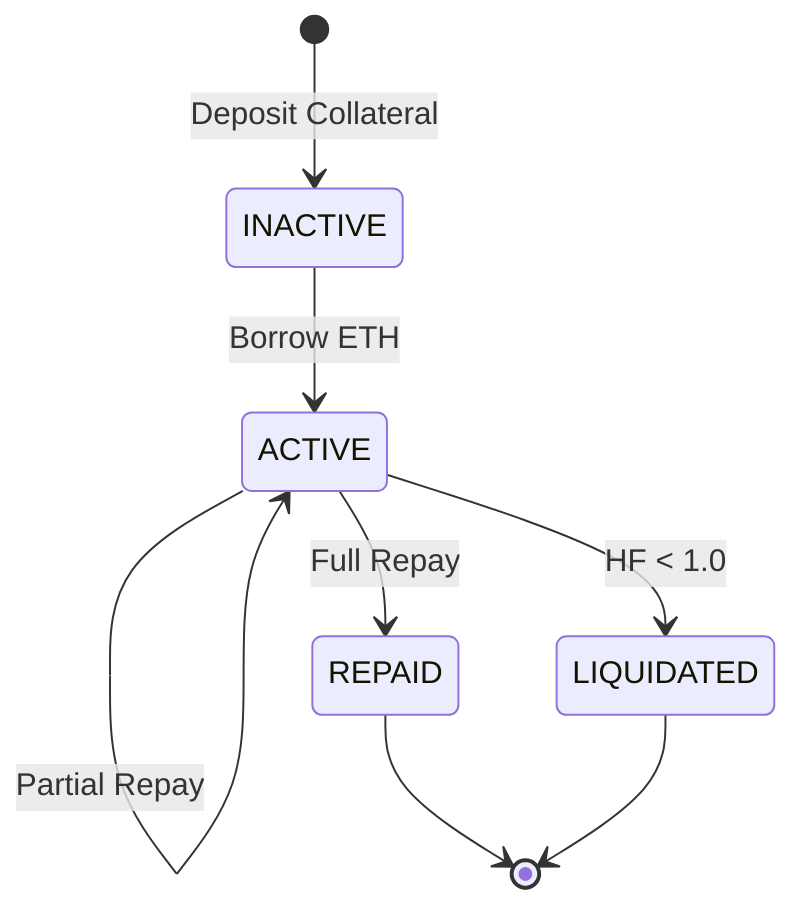
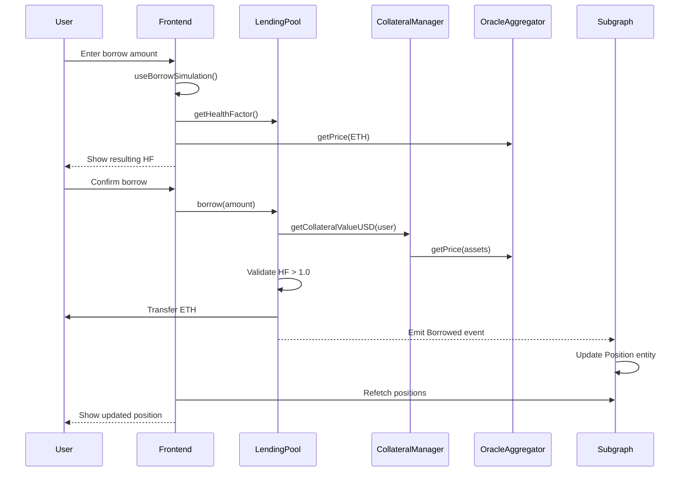
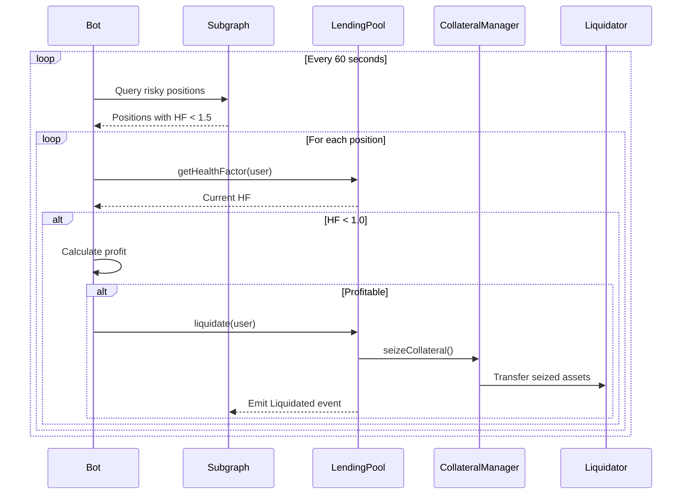

# LendForge Architecture

Detailed technical architecture of the LendForge DeFi lending protocol.

## Table of Contents

- [System Overview](#system-overview)
- [Smart Contracts](#smart-contracts)
- [Oracle System](#oracle-system)
- [Frontend Architecture](#frontend-architecture)
- [Liquidation Bot](#liquidation-bot)
- [The Graph Subgraph](#the-graph-subgraph)
- [Data Flow Patterns](#data-flow-patterns)

---

## System Overview



---

## Smart Contracts

### Contract Interaction Diagram



### Contract Addresses (Sepolia)

| Contract | Address | Version |
|----------|---------|---------|
| LendingPool | `0x504BD0CcAF75881CfCD8f432983A56A5C4e5Aa84` | v3.0 |
| CollateralManager | `0x53Ea723AA0C4cd5eF459eE9351D3f9875D821758` | v1.1 |
| OracleAggregator | `0x62f41B1EDc66bC46e05c34AC40B447E5A7ab3EAe` | v3.1 |

### Key Functions

**LendingPool:**
- `borrow(uint256 amount)` — Borrow ETH against collateral
- `repay(uint256 amount)` — Repay borrowed ETH
- `liquidate(address user)` — Liquidate unhealthy position
- `getHealthFactor(address user)` — Get position health (scaled 100x)

**CollateralManager:**
- `depositETH()` — Deposit native ETH as collateral
- `depositToken(address asset, uint256 amount)` — Deposit ERC20
- `withdrawCollateral(address asset, uint256 amount)` — Withdraw collateral
- `getCollateralValueUSD(address user)` — Total collateral in USD

**OracleAggregator:**
- `getPrice(address asset)` — Get current price (8 decimals)
- `getPriceWithDeviation(address asset)` — Price + deviation data
- `setEmergencyMode(bool enabled)` — Pause on critical deviation

---

## Oracle System

### Dual-Oracle Architecture



### Deviation Thresholds

| Deviation | Action | Operations Allowed |
|-----------|--------|-------------------|
| < 5% | Use Chainlink | All |
| 5-10% | Use TWAP + emit warning | All |
| > 10% | Emergency mode | Repay, Withdraw, Liquidate only |

### Price Sources

- **Chainlink (Primary):** Real ETH/USD feed on Sepolia
- **Uniswap V3 TWAP (Fallback):** 30-minute time-weighted average
- **Manual Provider (Emergency):** Admin-controlled injection

---

## Frontend Architecture

### Component Structure



### Data Source Strategy

| Data Type | Source | Refresh Rate | Use Case |
|-----------|--------|--------------|----------|
| Position balance | On-chain (Wagmi) | 5 seconds | Dashboard, Borrow, Repay |
| Health factor | On-chain (Wagmi) | 5 seconds | Real-time monitoring |
| Oracle prices | On-chain (Wagmi) | 5 seconds | Calculations |
| Position history | Subgraph (Apollo) | 5-30 seconds | Positions page |
| Global metrics | Subgraph (Apollo) | 5-30 seconds | Landing, Analytics |

### Key Hooks

```typescript
// Real-time position data
useOnChainPosition(address) → { collateral, borrowed, healthFactor }

// Health factor with status
useHealthFactor(address) → { hf, status, canBorrow, maxBorrow }

// Simulation before transaction
useBorrowSimulation(amount) → { resultingHF, isValid }
useWithdrawSimulation(asset, amount) → { resultingHF, maxWithdrawable }
```

---

## Liquidation Bot

### Bot Architecture



### Profitability Formula

```python
# Liquidation profit calculation
collateral_seized_usd = debt_to_repay * (1 + LIQUIDATION_BONUS)
gas_cost_usd = gas_used * gas_price * eth_price
profit = collateral_seized_usd - debt_to_repay - gas_cost_usd

# Execution criteria
MIN_PROFIT_USD = 5.0
MAX_GAS_PRICE_GWEI = 50
```

### Bot Configuration

| Parameter | Value | Description |
|-----------|-------|-------------|
| `MONITOR_INTERVAL_SECONDS` | 60 | Check frequency |
| `MIN_PROFIT_USD` | 5.0 | Minimum profit threshold |
| `MAX_GAS_PRICE_GWEI` | 50 | Max gas price to execute |
| `HEALTH_FACTOR_THRESHOLD` | 1.0 | Liquidation trigger |

---

## The Graph Subgraph

### Entity Relationships



### Position Status Flow



### Event Handlers

| Event | Handler | Entities Updated |
|-------|---------|-----------------|
| `CollateralDeposited` | `handleCollateralDeposited` | User, UserCollateral, GlobalMetric |
| `CollateralWithdrawn` | `handleCollateralWithdrawn` | User, UserCollateral, GlobalMetric |
| `Borrowed` | `handleBorrowed` | User, Position, GlobalMetric |
| `Repaid` | `handleRepaid` | User, Position |
| `Liquidated` | `handleLiquidated` | User, Position, Liquidation |

---

## Data Flow Patterns

### Borrow Flow



### Liquidation Flow



---

## Known Limitations

### MVP Workarounds

| ID | Issue | Workaround | Status |
|----|-------|-----------|--------|
| ANO_001 | `globalMetric.activePositions` always 0 | Count users with `activePositions > 0` | Documented |
| ANO_003 | `UserCollateral.valueUSD` stores total | Calculate `amount × price` client-side | Applied |
| ANO_009 | Cross-user data contamination | Centralized helpers + disabled cache | Resolved |

### Pre-Mainnet Requirements

- [ ] Professional security audit
- [ ] Multi-sig admin wallet
- [ ] DAO governance framework
- [ ] Interest rate model
- [ ] Circuit breakers (TVL caps)

---

## Resources

- **Subgraph Playground:** [TheGraph Studio](https://api.studio.thegraph.com/query/122308/lendforge-v-4/version/latest)
- **Contract Explorer:** [Sepolia Etherscan](https://sepolia.etherscan.io)
- **Known Issues:** `/_docs/KNOWN_ISSUES_ANO.json`
