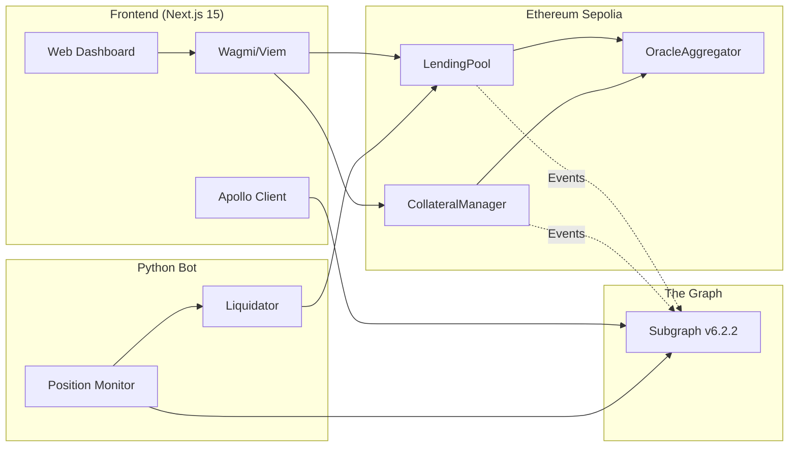
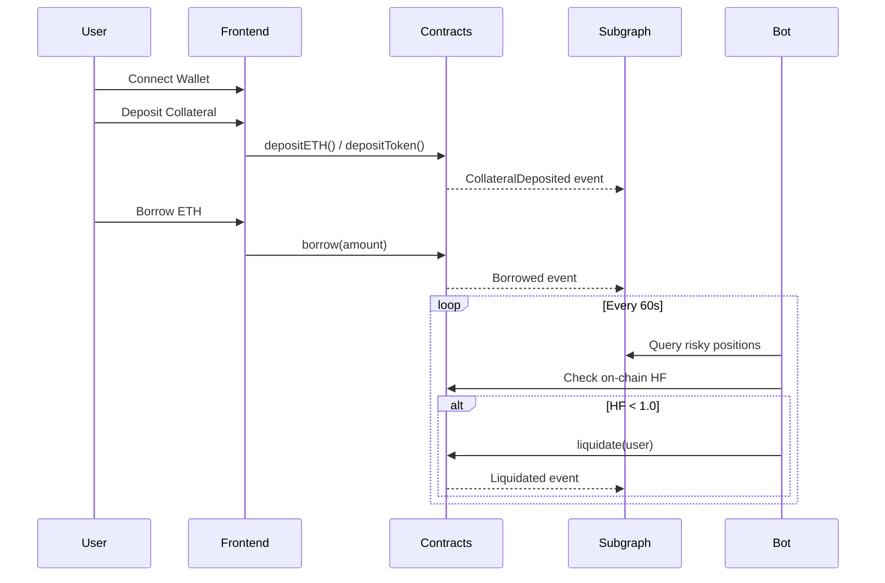

# LendForge

> Decentralized lending protocol with multi-collateral support, automated liquidations, and dual-oracle price feeds.

## System Architecture



## Overview

LendForge is a full-stack DeFi lending platform where users deposit collateral (ETH, USDC, DAI) to borrow ETH. The protocol features automated liquidations via a Python bot, real-time health factor monitoring, and a dual-oracle system with Chainlink primary feeds and Uniswap V3 TWAP fallback.

**Status:** MVP on Sepolia Testnet (v6.3.1)

## Tech Stack

| Layer | Technologies |
|-------|-------------|
| **Smart Contracts** | Solidity 0.8.20, Foundry, OpenZeppelin |
| **Indexing** | The Graph (GraphQL subgraph) |
| **Frontend** | Next.js 15, TypeScript, Wagmi v2, RainbowKit, TailwindCSS |
| **Automation** | Python 3.x, Flask, APScheduler, Web3.py |
| **Oracles** | Chainlink Price Feeds, Uniswap V3 TWAP |

## Key Features

- **Multi-Collateral Support** — Deposit ETH, USDC, or DAI as collateral
- **Health Factor Monitoring** — Real-time position health with liquidation alerts
- **Automated Liquidations** — Python bot executes profitable liquidations
- **Dual-Oracle System** — Chainlink primary with Uniswap TWAP fallback (5% deviation trigger)
- **Emergency Mode** — Auto-pause on >10% price deviation
- **Proportional Liquidation** — Multi-asset seizure with user protection

## Deployed Contracts (Sepolia)

| Contract | Address | Description |
|----------|---------|-------------|
| LendingPool | `0x504BD0CcAF75881CfCD8f432983A56A5C4e5Aa84` | Borrow/Repay/Liquidate |
| CollateralManager | `0x53Ea723AA0C4cd5eF459eE9351D3f9875D821758` | Multi-asset deposits |
| OracleAggregator | `0x62f41B1EDc66bC46e05c34AC40B447E5A7ab3EAe` | Price feeds + fallback |
| USDC (Mock) | `0xC47095AD18C67FBa7E46D56BDBB014901f3e327b` | Test stablecoin |
| DAI (Mock) | `0x2FA332E8337642891885453Fd40a7a7Bb010B71a` | Test stablecoin |

## Protocol Parameters

| Parameter | ETH | USDC/DAI |
|-----------|-----|----------|
| LTV (Loan-to-Value) | 66% | 90% |
| Liquidation Threshold | 83% | 95% |
| Liquidation Penalty | 10% | 5% |

**Health Factor Formula:**
```
HF = (Collateral USD × Liquidation Threshold) / Debt USD
Liquidation triggered when HF < 1.0
```

## Quick Start

### Prerequisites
- Node.js 18+
- Python 3.11+
- Foundry
- Git

### 1. Clone & Install

```bash
git clone https://github.com/your-username/lendforge.git
cd lendforge

# Install contract dependencies
forge install

# Install frontend dependencies
cd frontend && npm install

# Install bot dependencies
cd ../bot && pip install -r requirements.txt
```

### 2. Environment Setup

```bash
cp .env.example .env
# Edit .env with your RPC URL and private keys
```

### 3. Run Components

**Frontend:**
```bash
cd frontend
npm run dev
# Open http://localhost:3000
```

**Liquidation Bot:**
```bash
cd bot
python -m src.main
# Monitors positions every 60s
```

**Run Tests:**
```bash
forge test -vvv
```

## Project Structure

```
lendforge/
├── contracts/           # Solidity smart contracts
│   ├── LendingPool.sol
│   ├── CollateralManager.sol
│   ├── oracles/
│   └── libraries/
├── frontend/            # Next.js 15 application
│   ├── app/
│   ├── components/
│   └── hooks/
├── bot/                 # Python liquidation bot
│   └── src/
├── subgraph/            # The Graph indexer
│   └── src/
├── scripts/             # Deployment & utility scripts
└── _docs/               # Technical documentation
```

## Documentation

- [Architecture Details](./docs/ARCHITECTURE.md) — System design with diagrams
- [Known Issues](/_docs/KNOWN_ISSUES_ANO.json) — Documented anomalies & workarounds
- [Contract Specs](./README.md#protocol-parameters) — LTV, thresholds, formulas

## Data Flow



## API Endpoints (Bot)

| Endpoint | Method | Description |
|----------|--------|-------------|
| `/health` | GET | Bot health check |
| `/status` | GET | Monitored positions count |
| `/metrics` | GET | Liquidation statistics |
| `/risky-positions` | GET | Positions near liquidation |

## Subgraph Queries

```graphql
# Get user positions
query GetUserPositions($user: String!) {
  positions(where: { user: $user }) {
    id
    borrowed
    totalCollateralUSD
    healthFactor
    status
  }
}

# Get liquidatable positions
query GetLiquidatable {
  positions(where: { healthFactor_lt: "1.0", status: ACTIVE }) {
    user { id }
    borrowed
    healthFactor
  }
}
```

**Subgraph Playground:** [TheGraph Studio](https://api.studio.thegraph.com/query/122308/lendforge-v-4/version/latest)

## Testing

```bash
# Run all contract tests
forge test

# Run with verbosity
forge test -vvv

# Coverage report
forge coverage

# Bot unit tests
cd bot && python -m pytest
```

**Test Coverage:** >90% on core contracts

## Known Limitations (MVP)

This is an MVP with documented workarounds. See `_docs/KNOWN_ISSUES_ANO.json` for details:

- **ANO_001:** Active positions count uses user aggregation workaround
- **ANO_003:** USD values calculated client-side (amount × price)
- Centralized admin (no DAO/multi-sig yet)
- Sepolia testnet only

## Roadmap

- [x] Multi-collateral support (ETH, USDC, DAI)
- [x] Automated liquidations with proportional distribution
- [x] Dual-oracle with deviation-based fallback
- [x] Real-time health factor monitoring
- [ ] Interest rate model
- [ ] DAO governance
- [ ] Mainnet deployment (requires audit)

## License

MIT

## Contact

Built as a portfolio project demonstrating full-stack DeFi development.

- Solidity/Foundry smart contracts
- Python backend automation
- Next.js/TypeScript frontend
- The Graph indexing
- Production-grade oracle architecture
